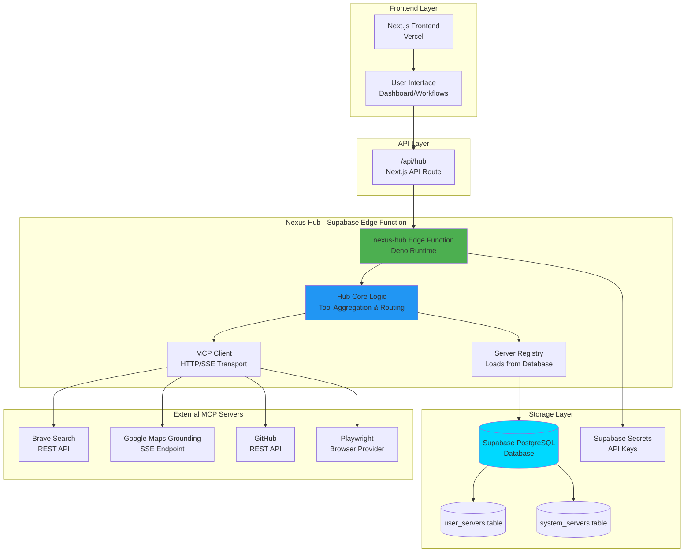
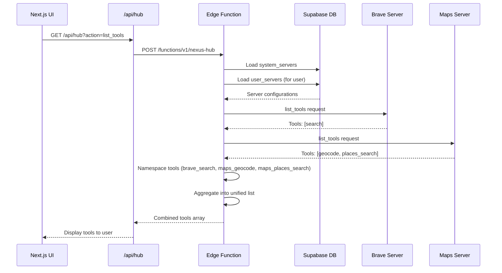
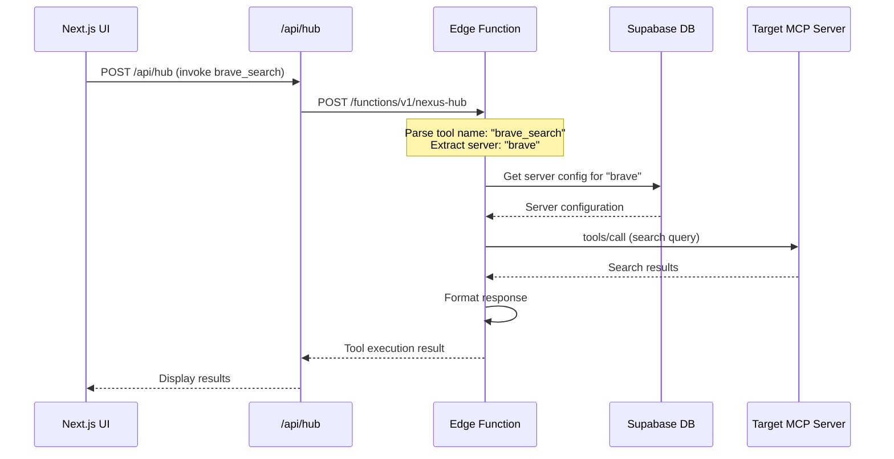
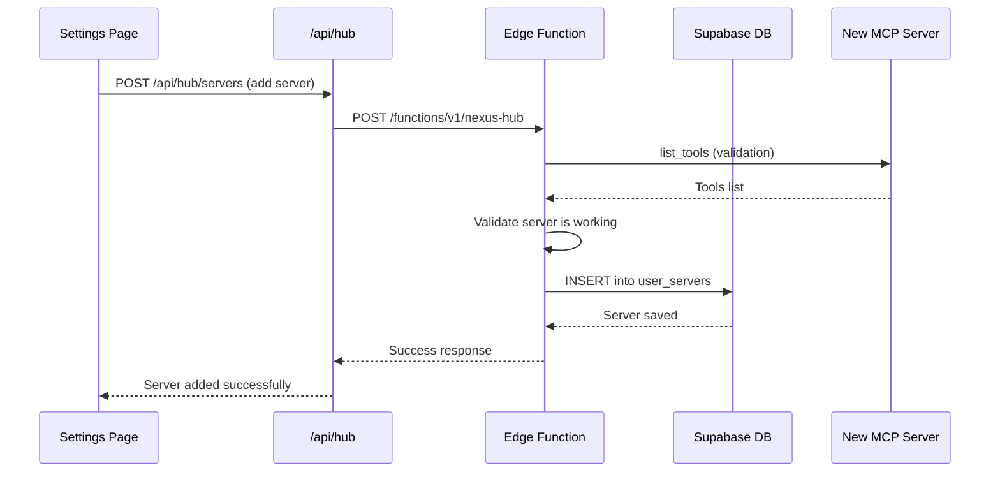
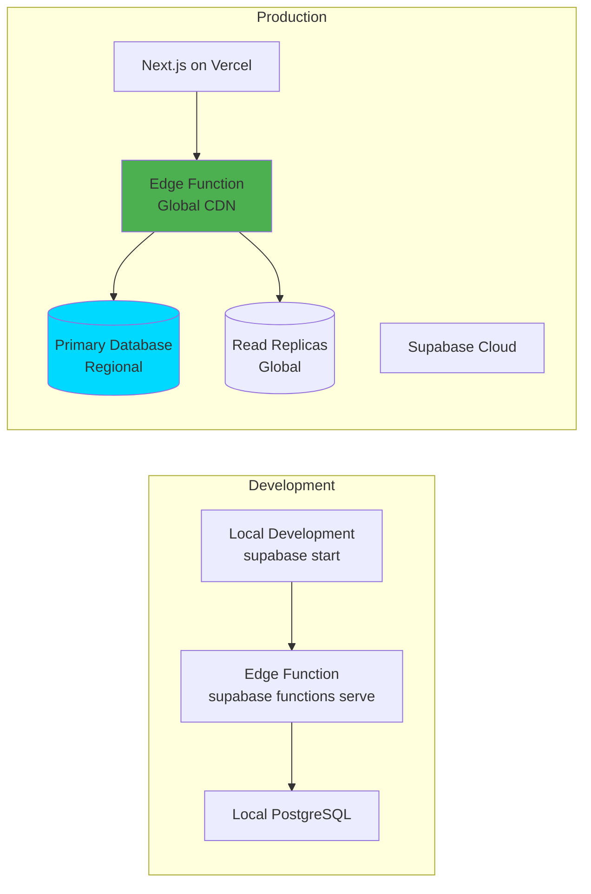

# Nexus Hub Architecture

## Overview

The Nexus Hub is a centralized multiplexer service that aggregates multiple MCP (Model Context Protocol) servers into a unified interface. Built as a Supabase Edge Function, it acts as an intermediary between the Next.js frontend and various MCP servers, providing tool aggregation, routing, and user server management.

## High-Level Architecture



## Data Flow

### 1. Tool Aggregation Flow



### 2. Tool Invocation Flow



### 3. User Server Management Flow



## Component Breakdown

### 1. Next.js Frontend (Vercel)

**Location**: Current Next.js application

**Responsibilities**:
- User interface for workflows, dashboard, monitoring
- API route proxy (`/api/hub`) that forwards requests to Supabase Edge Function
- User authentication (can integrate with Supabase Auth)
- Server management UI (settings page)

**Key Files**:
- `app/api/hub/route.ts` - Proxy to Supabase Edge Function
- `app/dashboard/page.tsx` - Main dashboard
- `app/workflows/page.tsx` - Workflow interface
- `components/` - UI components

### 2. Supabase Edge Function: nexus-hub

**Location**: `supabase/functions/nexus-hub/`

**Runtime**: Deno (managed by Supabase)

**Entry Point**: `index.ts`

**Responsibilities**:
- Receive requests from Next.js frontend
- Authenticate users via JWT tokens
- Aggregate tools from all registered servers
- Route tool invocations to correct servers
- Manage user server configurations
- Handle errors and graceful degradation

**Key Components**:

#### 2.1 Hub Core (`lib/hub.ts`)
- `aggregateTools(userId)`: Fetches and combines tools from all servers
- `invokeTool(userId, toolName, params)`: Routes tool calls to appropriate server
- `validateServer(config)`: Validates new server before adding
- `healthCheck(userId)`: Checks status of all servers

#### 2.2 Server Registry (`servers/registry.ts`)
- Loads system servers from database
- Loads user servers from database
- Provides unified interface for server access
- Caches server configurations (per request)

#### 2.3 MCP Client (`lib/mcp_client.ts`)
- Handles HTTP/SSE transport
- JSON-RPC 2.0 protocol implementation
- Tool schema caching (in-memory, per request)
- Error handling and retries

#### 2.4 Server Adapters (`servers/`)

**Brave Adapter** (`servers/brave.ts`):
- Connects to Brave Search API via REST
- Transforms API responses to MCP tool format
- Handles API key authentication

**Maps Adapter** (`servers/maps.ts`):
- Connects to Google Maps Grounding Lite via SSE
- Handles `X-Goog-Api-Key` header
- Parses SSE event streams

**GitHub Adapter** (`servers/github.ts`):
- Uses Octokit for GitHub API
- Converts GitHub operations to MCP tools
- Handles user-provided tokens (encrypted storage)

**Playwright Adapter** (`servers/playwright.ts`):
- Proxies to external browser provider (Browserless.io)
- WebSocket connections for browser automation
- Handles browser session management

### 3. Supabase Database

**Tables**:

#### `system_servers`
Pre-configured system servers available to all users.

| Column | Type | Description |
|--------|------|-------------|
| id | text (PK) | Server identifier (e.g., "brave", "maps") |
| name | text | Human-readable name |
| config | jsonb | Server configuration (URL, headers, etc.) |
| enabled | boolean | Whether server is active |

**Example row**:
```json
{
  "id": "brave",
  "name": "Brave Search",
  "config": {
    "transport": "http",
    "url": "https://api.search.brave.com/res/v1/web/search",
    "headers": {}
  },
  "enabled": true
}
```

#### `user_servers`
User-configured custom MCP servers.

| Column | Type | Description |
|--------|------|-------------|
| id | uuid (PK) | Unique server instance ID |
| user_id | uuid/text | User identifier (from auth) |
| server_id | text | Server type/identifier |
| name | text | User-defined name |
| transport | text | "http" or "stdio" |
| config | jsonb | Server-specific configuration |
| enabled | boolean | Whether server is active |
| created_at | timestamptz | Creation timestamp |

**Example row**:
```json
{
  "id": "550e8400-e29b-41d4-a716-446655440000",
  "user_id": "user-123",
  "server_id": "custom-github",
  "name": "My GitHub Server",
  "transport": "http",
  "config": {
    "url": "https://api.github.com",
    "headers": {
      "Authorization": "token ***"
    }
  },
  "enabled": true,
  "created_at": "2024-01-01T00:00:00Z"
}
```

**Row Level Security (RLS)**:
- Users can only read/write their own `user_servers` records
- System servers are readable by all authenticated users

### 4. External MCP Servers

**Brave Search**:
- Type: REST API
- Authentication: API key (stored in Supabase secrets)
- Tools: `search` → namespaced as `brave_search`

**Google Maps Grounding**:
- Type: SSE endpoint
- Authentication: API key in header (from Supabase secrets)
- Tools: `geocode`, `places_search` → namespaced as `maps_geocode`, `maps_places_search`

**GitHub**:
- Type: REST API (via Octokit)
- Authentication: User-provided tokens (encrypted in database)
- Tools: Various GitHub operations → namespaced as `github_*`

**Playwright**:
- Type: WebSocket (browser provider)
- Authentication: Connection string/API key
- Tools: Browser automation tools → namespaced as `playwright_*`

## Tool Namespacing Strategy

To prevent tool name conflicts, all tools are namespaced with their server ID prefix:

| Original Tool | Server | Namespaced Tool |
|--------------|--------|----------------|
| `search` | brave | `brave_search` |
| `geocode` | maps | `maps_geocode` |
| `places_search` | maps | `maps_places_search` |
| `create_issue` | github | `github_create_issue` |
| `screenshot` | playwright | `playwright_screenshot` |

**Routing Logic**:
1. Parse tool name to extract server prefix (e.g., `brave_search` → server: `brave`, tool: `search`)
2. Look up server configuration from registry
3. Route invocation to appropriate server adapter
4. Return results with original tool name context

## Authentication & Authorization

### Current Implementation
- User ID extracted from JWT token in Authorization header
- Next.js frontend passes JWT token from Supabase Auth
- Edge Function validates token automatically via Supabase client

### Future Enhancements
- Full Supabase Auth integration
- Role-based access control (RBAC)
- Organization-level server sharing
- API key authentication for programmatic access

## Error Handling & Resilience

### Graceful Degradation
- If one server fails, others continue working
- Failed servers return error in health check but don't block aggregation
- Tool invocation errors are returned to client with server context

### Retry Logic
- Transient network errors: 3 retries with exponential backoff
- Server validation: Single attempt with timeout
- Tool invocation: Single attempt (client can retry)

### Caching Strategy
- Tool schemas: In-memory cache per request (edge functions are stateless)
- Server configurations: Loaded from database on each request (low latency with Supabase)
- Consider: Redis cache for tool schemas if request volume is high

## Deployment Architecture



## Environment Variables

### Next.js (Vercel)
- `NEXT_PUBLIC_SUPABASE_URL` - Supabase project URL
- `NEXT_PUBLIC_SUPABASE_ANON_KEY` - Supabase anonymous key
- `SUPABASE_SERVICE_ROLE_KEY` - Service role key (server-side only)

### Supabase Edge Function
- `SUPABASE_URL` - Auto-provided by Supabase
- `SUPABASE_ANON_KEY` - Auto-provided by Supabase
- Secrets (via `supabase secrets set`):
  - `BRAVE_API_KEY` - Brave Search API key
  - `GOOGLE_MAPS_GROUNDING_API_KEY` - Google Maps API key
  - `PLAYWRIGHT_ENDPOINT` - Browser provider endpoint (optional)

## Performance Considerations

### Latency Optimization
- Edge functions deployed globally (CDN)
- Database queries optimized with indexes
- Tool schema caching (per request)
- Parallel server tool fetching where possible

### Scalability
- Stateless edge functions (horizontal scaling)
- Database connection pooling
- Read replicas for database queries
- Rate limiting per user/server

### Cost Optimization
- Edge function invocations: Pay per request
- Database queries: Optimize to minimize calls
- Cache tool schemas to reduce external API calls
- Batch server health checks

## Security Considerations

### Data Protection
- User tokens encrypted at rest in database
- API keys stored as Supabase secrets (encrypted)
- RLS policies prevent user data leakage
- JWT tokens validated on every request

### Network Security
- HTTPS only (enforced by Supabase)
- CORS configured for Next.js domain only
- API keys never exposed to frontend
- WebSocket connections secured (WSS)

### Access Control
- Users can only manage their own servers
- System servers read-only for users
- Server validation prevents malicious endpoints
- Rate limiting prevents abuse

## Future Enhancements

### Phase 2 Features
- Organization-level server sharing
- Server templates/marketplace
- Tool usage analytics
- Webhook support for server events
- Server health monitoring dashboard

### Phase 3 Features
- Multi-region deployment
- Server auto-scaling
- Tool versioning
- A/B testing for server configurations
- Advanced caching strategies

## Migration Strategy

### Phase 1: Setup (Week 1)
1. Initialize Supabase project
2. Create database schema
3. Seed system servers
4. Deploy edge function (minimal implementation)

### Phase 2: Core Functionality (Week 2)
1. Implement tool aggregation
2. Implement tool routing
3. Implement server registry
4. Test with system servers

### Phase 3: User Management (Week 3)
1. Implement user server CRUD
2. Add server validation
3. Update Next.js UI for server management
4. Test user workflows

### Phase 4: Integration (Week 4)
1. Update Next.js to use edge function
2. Migrate existing `/api/mcp` calls
3. Add error handling and monitoring
4. Performance testing and optimization

### Phase 5: Production (Week 5)
1. Load testing
2. Security audit
3. Documentation
4. Production deployment
5. Monitor and iterate

## API Reference

### Edge Function Endpoints

#### POST `/functions/v1/nexus-hub`

Main multiplexer endpoint.

**Request Body**:
```json
{
  "action": "list_tools" | "invoke" | "health",
  "userId": "user-123",
  "toolName": "brave_search",  // Required for "invoke"
  "params": {                   // Required for "invoke"
    "query": "search term"
  }
}
```

**Response (list_tools)**:
```json
{
  "tools": [
    {
      "name": "brave_search",
      "description": "Search the web using Brave",
      "inputSchema": { ... }
    },
    {
      "name": "maps_geocode",
      "description": "Geocode an address",
      "inputSchema": { ... }
    }
  ]
}
```

**Response (invoke)**:
```json
{
  "result": {
    "content": [ ... ],
    "isError": false
  }
}
```

**Response (health)**:
```json
{
  "servers": [
    {
      "id": "brave",
      "healthy": true,
      "toolsCount": 1
    },
    {
      "id": "maps",
      "healthy": true,
      "toolsCount": 2
    }
  ]
}
```

## Conclusion

This architecture provides a scalable, maintainable solution for aggregating multiple MCP servers into a unified interface. By leveraging Supabase Edge Functions, we achieve:

- **Simplicity**: Single platform for database and compute
- **Performance**: Global CDN deployment with low latency
- **Security**: Built-in authentication and authorization
- **Scalability**: Stateless functions with horizontal scaling
- **Developer Experience**: Unified tooling and local development

The modular design allows for easy extension with new server adapters and features, making it a robust foundation for the Nexus platform.
